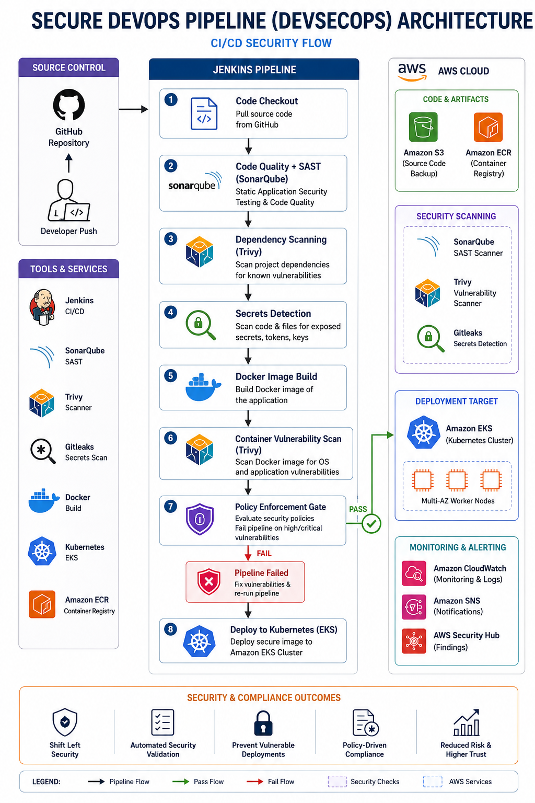

# Secure DevSecOps Pipeline on AWS

## Overview

This project demonstrates a production-grade Secure DevOps Pipeline integrating automated security controls directly into CI/CD workflows.

The pipeline automatically:

* scans code quality
* performs SAST analysis
* scans dependencies
* detects secrets
* scans Docker images
* blocks insecure deployments
* deploys validated workloads into Amazon EKS


# Architecture

Developer Push

→ GitHub Repository

→ Jenkins Pipeline

→ SonarQube SAST

→ Trivy Dependency Scan

→ Secrets Detection

→ Docker Image Build

→ Container Scan

→ Security Policy Gate

→ Amazon EKS Deployment



# Core Features

## SAST Scanning

SonarQube analyzes source code quality and vulnerabilities.

## Dependency Scanning

Trivy scans dependencies for known CVEs.

## Secrets Detection

The pipeline detects exposed credentials and API keys.

## Container Security

Docker images are scanned before deployment.

## Policy Enforcement

The pipeline automatically fails if critical vulnerabilities are found.


# Tech Stack

* Jenkins
* Docker
* SonarQube
* Trivy
* Terraform
* Amazon EKS
* Kubernetes


# Setup

## 1. Clone Repository

```bash
git clone https://github.com/ericpaatey/secure-devsecops-pipeline.git
```

## 2. Provision Infrastructure

```bash
cd terraform

terraform init
terraform apply
```

## 3. Deploy SonarQube

```bash
docker run -d -p 9000:9000 sonarqube:lts
```

## 4. Configure Jenkins

Install:

* Docker
* kubectl
* Terraform
* SonarQube Scanner
* Trivy

# Pipeline Workflow

1. Code pushed to GitHub
2. Jenkins pipeline triggered
3. SonarQube performs SAST
4. Trivy scans dependencies
5. Secrets detection runs
6. Docker image built
7. Container vulnerability scan executed
8. Policy gate validates results
9. Secure workloads deployed to EKS


# Why This Project Matters

Most DevOps projects focus only on deployment automation.

This project demonstrates:

* DevSecOps engineering
* automated security enforcement
* secure CI/CD
* vulnerability management
* production-grade governance

Modern CI/CD pipelines should actively protect production systems and not simply deploy applications.


